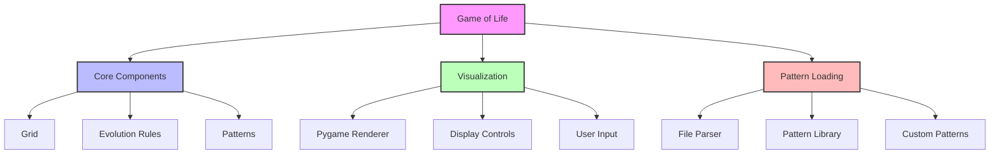
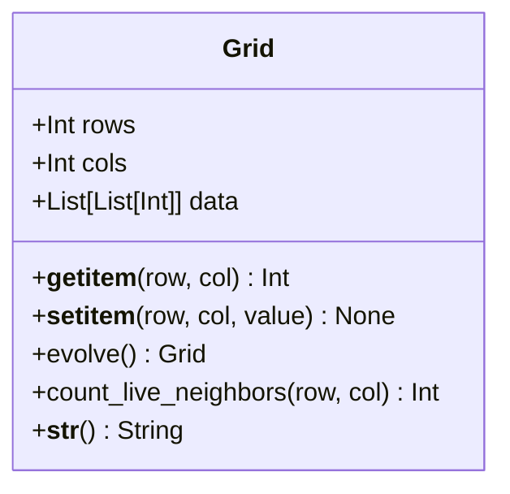
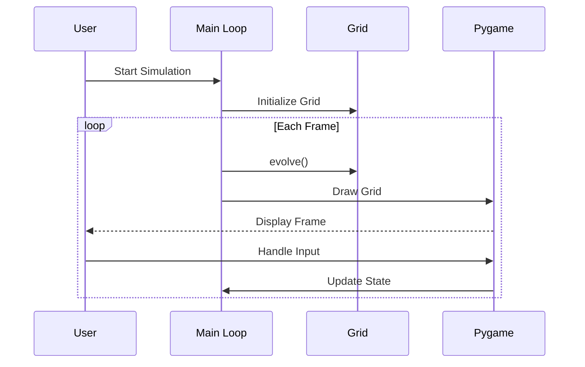
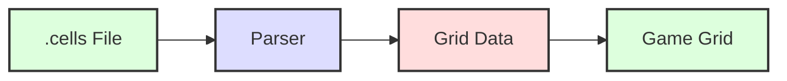
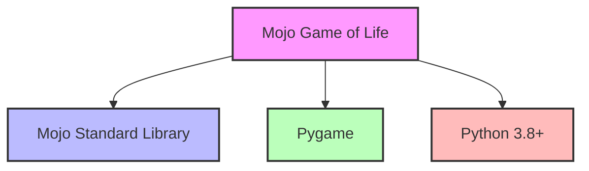

# System Architecture

This document provides an overview of the Mojo Game of Life project's architecture, components, and their interactions.

## High-Level Architecture



## Core Components

### Grid

The `Grid` class is the fundamental data structure that represents the Game of Life universe:



### Evolution Rules

The rules of Conway's Game of Life are implemented in the `evolve` method:

1. **Survival**: A live cell with 2 or 3 live neighbors survives
2. **Death**: A live cell with fewer than 2 or more than 3 live neighbors dies
3. **Birth**: A dead cell with exactly 3 live neighbors becomes a live cell

## Visualization

The visualization layer is built using Pygame:



## Pattern Loading

Patterns can be loaded from `.cells` files:



## Data Flow

1. **Initialization**:
   - Load configuration
   - Initialize grid (random or from pattern)
   - Set up Pygame window

2. **Main Loop**:
   - Process user input
   - Update grid state based on rules
   - Render current state
   - Control frame rate

3. **Shutdown**:
   - Save state if needed
   - Clean up resources

## Dependencies



## Directory Structure

```
mojo-game-of-life/
├── life/                  # Core implementation
│   ├── life.mojo          # Main implementation file
│   └── gridv1.mojo        # Grid implementation
├── examples/              # Example patterns and utilities
│   ├── patterns/          # Pattern files
│   │   ├── glider.cells
│   │   ├── blinker.cells
│   │   └── glider_gun.cells
│   └── README.md          # Examples documentation
├── docs/                  # Documentation
│   ├── docs/              # MkDocs source files
│   └── mkdocs.yml         # MkDocs configuration
├── README.md              # Project overview
└── llms.txt              # Mojo language configuration
```

## Performance Considerations

1. **Grid Representation**:
   - Uses a list of lists for simplicity
   - Could be optimized with NumPy arrays or bit manipulation

2. **Evolution Algorithm**:
   - Naive implementation for clarity
   - Could be optimized with memoization or parallel processing

3. **Rendering**:
   - Redraws entire grid each frame
   - Could be optimized with dirty rectangle techniques

## Extensibility

The architecture supports several extension points:

1. **New Patterns**: Add `.cells` files to the patterns directory
2. **Custom Rules**: Override the `evolve` method
3. **Visualization**: Replace the Pygame renderer
4. **Input Handling**: Add new keyboard/mouse controls

## Future Improvements

1. **Performance**:
   - Implement HashLife algorithm
   - Add GPU acceleration
   - Optimize for large grids

2. **Features**:
   - Pattern editor
   - Recording/playback
   - Multiple simulation views

3. **Documentation**:
   - Interactive examples
   - Tutorial videos
   - API reference
